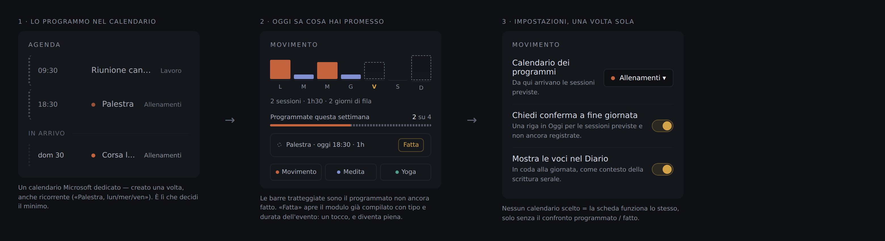
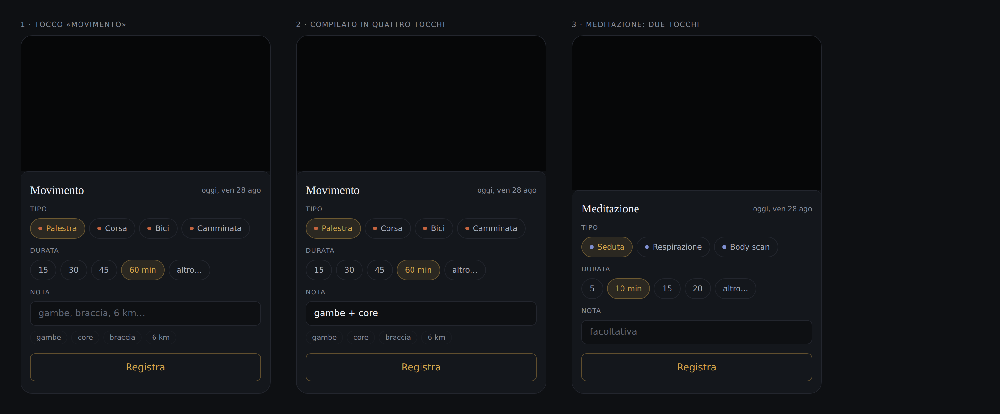
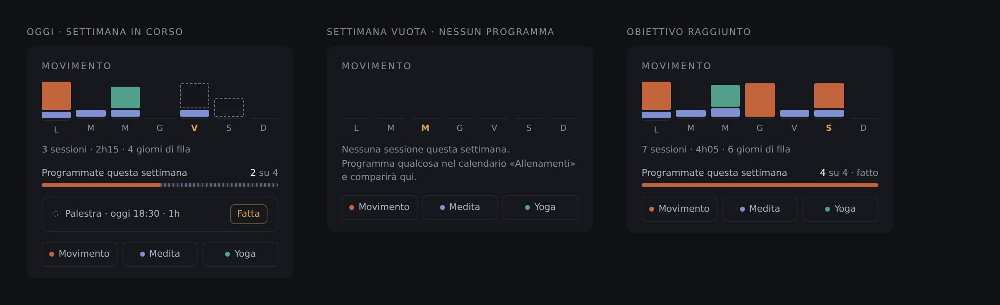

# Proposta: la scheda «Movimento»

> **Approvata e costruita** (fasi 1–3). Il documento resta com'era scritto in
> fase di proposta — è il ragionamento che ha portato alle scelte, e serve più
> quello del riassunto di cosa è stato fatto. In fondo, sotto *Cosa è stato
> costruito davvero*, ci sono i tre punti in cui il codice si è discostato.
>
> Il `LockedCard` inerte in `TodayView.jsx` non esiste più: era il segnaposto
> messo lì proprio perché non c'era una fonte dati sugli allenamenti.
>
> Le immagini sono mockup costruiti con i token e i CSS veri dell'app
> (`tokens.css`, `TodayView.css`), non disegni: i colori, le misure e la
> tipografia sono già quelli che si vedrebbero a schermo.

## Cosa deve contenere

Tre famiglie di attività, non una:

| Famiglia | Esempi | Cosa conta davvero |
|---|---|---|
| **Movimento** | corsa, palestra (gambe, braccia, spalle…), bici, camminata | che sia stato fatto, quanto è durato, cosa si è allenato |
| **Meditazione** | seduta del mattino, respirazione, body scan | che sia stata fatta, quanti minuti, la striscia |
| **Yoga** | flow, yin, mobilità | che sia stato fatto, quanti minuti, il tipo |

E, accanto alle tre, una quarta cosa che non è una famiglia ma un tempo verbale:
il **programmato**, cioè quello che hai deciso di fare e non hai (ancora) fatto.
Vive in un calendario, non nel registro — ci torno più sotto.

Il minimo indispensabile per ognuna è lo stesso: **data + tipo + durata**. Tutto
il resto (la nota «corsa 6 km», «palestra gambe», il come è andata) è
facoltativo e va scritto solo quando c'è voglia — è la stessa lezione del
Diario, dove il campo obbligatorio è una riga sola e il resto è libero.

## Dove tenere i dati: JSON su OneDrive, non OneNote

**Raccomandazione: un file JSON su OneDrive, con la stessa impalcatura del
Diario** (`mente-digitale-movimento-YYYY-MM.json` + un indice dei mesi).

Perché non OneNote:

- OneNote è **testo libero in HTML**. Per sapere «quante volte in palestra
  questo mese» bisognerebbe scaricare le pagine e riparsare l'HTML a ogni
  render: è esattamente il lavoro che fa la Daily Review, e infatti è la parte
  più fragile dell'app (vedi `extractOneNoteCandidates` in `dailyReview.js`).
- Le sette barrette del riquadro in «Oggi» sono un conteggio per giorno. Su
  JSON è un `filter` da due righe; su OneNote è una catena di richieste Graph
  per taccuino → sezione → pagina → contenuto.
- OneNote non ha un campo «durata». Qualsiasi struttura si inventi (una tabella,
  un tag, `[MIN:45]`) è una convenzione fragile — e nel repo c'è già la lapide
  di una convenzione del genere: il marker `[EIS:Qn]` scritto nelle note dei
  task, rimosso e ora solo da ripulire (`docs/roadmap-produttivita.md`).

Perché JSON su OneDrive:

- L'infrastruttura c'è già e funziona: `getDriveJson` / `putDriveJson` in
  `api.js`, cartella `mente-digitale/`, un file per mese e un indice dei mesi
  esattamente come `loadDiaryMonth` / `loadDiaryIndex`.
- Sincronizza su tutti i dispositivi con l'account Microsoft già collegato:
  nessun login nuovo, nessuna dipendenza nuova.
- È leggibile e modificabile a mano, e finisce nei backup di OneDrive.
- Se un giorno serve, esportarlo in una pagina OneNote di riepilogo è banale;
  il contrario no.

Le altre due strade, per completezza:

- **IndexedDB come Finanze.** Va bene per i conti, che sono personali e legati a
  un computer; qui il dato si crea dal telefono dopo l'allenamento e si guarda
  dal portatile la mattina. Serve la sincronizzazione, quindi no.
- **Calendario Microsoft come registro.** Un allenamento *fatto* non è un
  evento *pianificato*: tenerli nello stesso posto vuol dire distinguerli a
  colpi di parole chiave sul titolo, come già succede per le ricorrenze in
  `TodayView`. Il calendario però è **esattamente** il posto giusto per la
  parte pianificata — vedi la sezione qui sotto, dove smette di essere un
  ripiego e diventa metà della funzione.

## Il modello dati

Una voce per sessione, sullo stampo di `DiaryEntry`:

```jsonc
{
  "id": "mv_2026-08-26_a1b2",
  "date": "2026-08-26",          // 'YYYY-MM-DD' locale
  "famiglia": "movimento",       // 'movimento' | 'meditazione' | 'yoga'
  "tipo": "palestra",            // corsa | palestra | bici | camminata |
                                 // meditazione | yoga — l'elenco è configurabile
  "durataMin": 55,               // interi; il campo che alimenta i totali
  "nota": "gambe + core",        // libero, facoltativo: «corsa 6 km», «braccia»
  "tag": ["gambe", "core"],      // facoltativi, ricavati dalla nota o scelti
  "daEvento": "AAMkAGI2...",       // facoltativo: l'evento del calendario
                                   // da cui è nata, se registrata con «Fatta»
  "createdAt": "2026-08-26T19:40:11.000Z"
}
```

Due scelte da spiegare:

- **`famiglia` e `tipo` separati.** La famiglia decide il colore e la riga di
  totali («3 movimento · 4 meditazioni questa settimana»); il tipo è quello che
  si sceglie davvero al momento di registrare. Con un campo solo, aggiungere
  «bici» vorrebbe dire toccare ogni punto che raggruppa.
- **`daEvento`.** L'id dell'evento del calendario che questa sessione soddisfa.
  Serve a una cosa sola ma indispensabile: non riproporre «Fatta» per una
  sessione già registrata, e disegnare la barra piena al posto di quella
  tratteggiata. Assente per le sessioni registrate a mano.
- **`nota` libera + `tag` opzionali.** La richiesta è «volendo la possibilità di
  mettere qualche nota tipo corsa, palestra gambe, braccia»: la nota copre
  quello senza obbligare a nulla. I tag si suggeriscono dalle note già scritte
  (le ultime venti, come fa `destinationMru.js` per le destinazioni della
  cattura), così dopo due settimane «gambe» si sceglie con un tocco.

File e indice, identici al Diario:

```
mente-digitale/mente-digitale-movimento-2026-08.json   // [] di voci del mese
mente-digitale/mente-digitale-movimento-index.json     // { months: [...] }
```

L'unica preferenza da salvare è l'id del calendario dei programmi (più i due
interruttori del mockup 3): sta con le altre impostazioni su OneDrive, dove già
vivono i colori dei taccuini — non merita un file suo.

## Il collegamento col calendario: programmato ≠ fatto



**Il calendario tiene i programmi, il JSON tiene il registro.** Due cose
diverse, due posti diversi, nessuna ambiguità da risolvere a parole chiave.

1. **Un calendario Microsoft dedicato** (per esempio «Allenamenti»), creato una
   volta sola dall'app del calendario. Ci si mettono le sessioni previste, anche
   come serie ricorrente: «Palestra, lun/mer/ven, 18:30». **Quella serie è il
   minimo**: non serve un campo «obiettivo settimanale» da configurare
   nell'app, perché il numero di sessioni programmate nella settimana *è* già
   l'obiettivo, e si cambia dove si cambiano tutti gli altri impegni.
2. **Oggi legge quel calendario** con `getCalendarEvents`, già in `api.js` e già
   usato dall'agenda. Nel riquadro le sessioni previste sono barre
   **tratteggiate**, quelle fatte sono **piene**: a colpo d'occhio si vede la
   differenza fra quello che avevi promesso e quello che hai fatto.
3. **La riga «programmato per oggi»**: se c'è una sessione prevista per oggi non
   ancora registrata, compare con il tasto **Fatta**. Un tocco apre il modulo
   già compilato con tipo e durata presi dall'evento — il gesto costa un tocco
   invece di quattro, ed è il caso più frequente di tutti.
4. **La riga di obiettivo**: «2 su 4 programmate questa settimana», con la barra
   che si riempie. Nessun numero inventato: il denominatore viene dal
   calendario, il numeratore dal registro.

Perché *un calendario dedicato* e non il calendario di tutti i giorni: perché il
filtro dev'essere una proprietà del dato, non un'euristica sul titolo. Con un
calendario a parte non c'è nessun «se il titolo contiene "palestra"» da
mantenere, l'agenda normale resta pulita, e per smettere di tracciare basta
deselezionare il calendario nelle impostazioni.

**Se non scegli nessun calendario la scheda funziona lo stesso**, solo senza il
confronto programmato / fatto: barre piene, striscia, totali. Il collegamento è
un potenziamento, non un requisito — e questo mi sembra il punto importante:
un giorno che non hai voglia di programmare niente, l'app non deve rinfacciartelo
con un riquadro mezzo vuoto.

Una nota su cosa **non** faccio: l'app non scrive nel calendario. Registrare una
sessione non crea né sposta né cancella eventi. Il calendario è di sola lettura,
come lo è già in agenda — così l'app non può rovinare i tuoi impegni veri, e la
sincronizzazione resta a senso unico e prevedibile.

## Come si registra



Il gesto deve costare meno del non farlo: si registra dal telefono, in piedi,
con una mano.

1. **Riquadro «Movimento» in Oggi.** Sotto le sette barrette, tre bottoni:
   `Movimento` · `Meditazione` · `Yoga`. Un tocco apre il modulo già impostato
   su quella famiglia.
2. **Il modulo**: tipo (chip da toccare, con l'ultimo usato in testa), durata
   (chip rapidi 15 / 30 / 45 / 60 min + campo libero), nota (una riga, con i
   tag recenti sotto). Il tasto salva è uno solo, e la data è oggi finché non la
   si cambia.
3. **Modifica**: toccare una barretta apre le voci di quel giorno.

Costo tipico: due tocchi per una meditazione da 15 minuti, quattro per
«palestra, 55 min, gambe + core».

## Come si legge



- **In Oggi** (il riquadro che oggi è finto): sette barrette, una per giorno,
  colorate per famiglia e alte in proporzione ai minuti; sotto, una riga di
  contesto — «3 sessioni · 2h15 · 4 giorni di fila», nello stesso tono della
  striscia del Diario.
- **Nel Diario**: le voci del giorno compaiono in coda alla giornata, come
  contesto della scrittura serale. Non si scrive niente di nuovo: è una lettura.
- **Più avanti, una pagina propria** (`/movimento`): mesi a calendario,
  minuti per famiglia, la striscia più lunga. Da fare solo se le prime due
  viste risultano strette — non prima.

## Il riquadro in Oggi va lasciato riservato?

No. Il PIN in «Oggi» copre i cento desideri e i conti perché sono cose che non
si vogliono leggibili alle spalle in ufficio. Quante volte si è corso questa
settimana non è di quella categoria: il riquadro Movimento resta in chiaro
come agenda e diario. Se un giorno cambiasse idea basta avvolgerlo in
`<SensitiveCard>` — è già il wrapper generico usato dagli altri due.

## Piano di lavoro

| Fase | Cosa | Dove |
|---|---|---|
| 1 | Modello + persistenza: `movimento.js` (tipi, id, striscia, totali) e `loadMovimentoMese` / `saveMovimento` in `api.js`, sullo stampo del Diario | `src/movimento.js`, `src/api.js` |
| 2 | Il riquadro vero in Oggi + il modulo di registrazione, al posto del `LockedCard` finto | `src/TodayView.jsx`, `src/MovimentoQuickAdd.jsx` |
| 3 | Il collegamento col calendario: scelta del calendario in Impostazioni, barre tratteggiate per il programmato, riga «Fatta» con modulo precompilato | `src/TodayView.jsx`, `src/ColorSettingsModal.jsx`, `src/api.js` |
| 4 | *Facoltativo:* voci del giorno in coda al Diario | `src/DiaryPanel.jsx` |
| 5 | *Facoltativo:* pagina `/movimento` con lo storico a mesi | `src/MovimentoView.jsx` |

Le fasi 1–3 insieme sono la funzione come sta nei mockup. Le ultime due si
valutano dopo qualche settimana d'uso — e la 5 solo se le prime viste risultano
strette davvero.


## Cosa è stato costruito davvero

Fasi 1, 2 e 3, in `movimento.js` (logica pura), `api.js` (registro su OneDrive),
`MovimentoCard.jsx` e `MovimentoQuickAdd.jsx`. Tre punti in cui il codice si è
discostato da questo documento, e il perché:

1. **Le impostazioni non sono una schermata.** Il mockup 3 mostra un pannello
   con tre righe; nel codice c'è solo la scelta del calendario, e sta in testa
   al riquadro — è l'etichetta col nome del calendario collegato, che si tocca
   per cambiarlo. Le altre due righe («chiedi conferma a fine giornata»,
   «mostra le voci nel Diario») appartengono alla fase 4, che non è stata
   fatta: una schermata di impostazioni per un campo solo è un posto in cui non
   si torna mai, e le Impostazioni generali dell'app sono i colori dei taccuini.
2. **La preferenza vive nell'indice del registro**, non fra le impostazioni su
   OneDrive come scritto sopra. È un campo solo, e chi legge il registro ha già
   bisogno dell'indice: un file a parte sarebbe stata una seconda richiesta a
   ogni apertura di «Oggi» per leggere una stringa.
3. **La famiglia di una sessione programmata si indovina dal titolo**
   (`famigliaEvento`). È l'unica euristica sul testo del documento, ed è meno
   grave di quella che ho rifiutato: **quali** eventi contano lo decide il
   calendario scelto — una proprietà del dato — e il titolo decide solo di che
   colore disegnare una barra che comparirebbe comunque. Se sbaglia, sbaglia
   una tinta; nessun evento entra o esce dal riquadro per colpa sua.

Non fatte, come previsto: le voci in coda al Diario (fase 4) e la pagina
`/movimento` con lo storico a mesi (fase 5). Si valutano dopo qualche settimana
d'uso vero.
